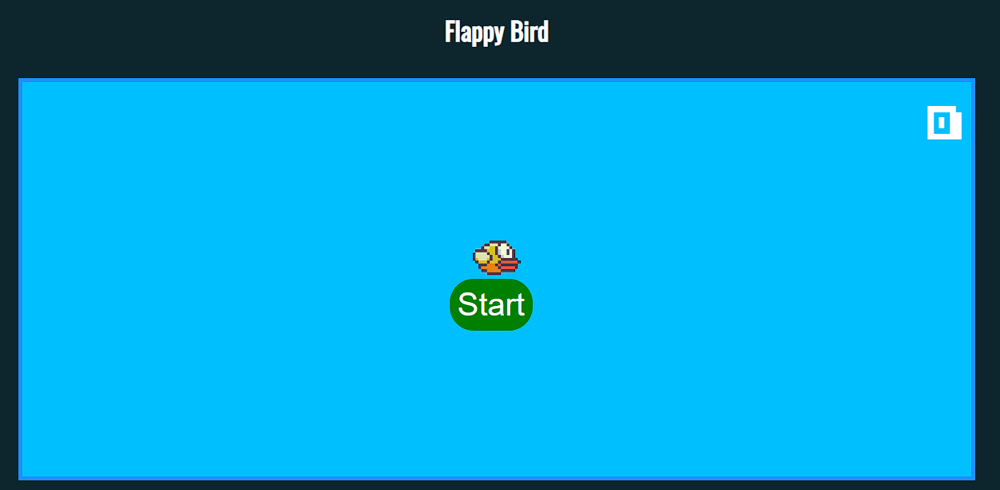
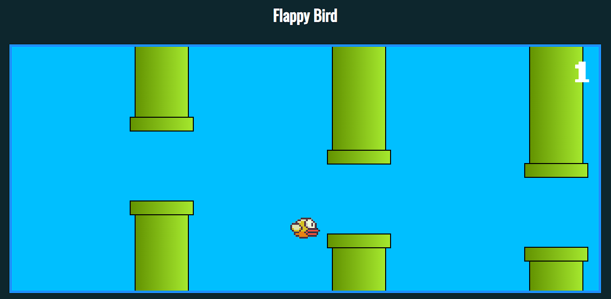
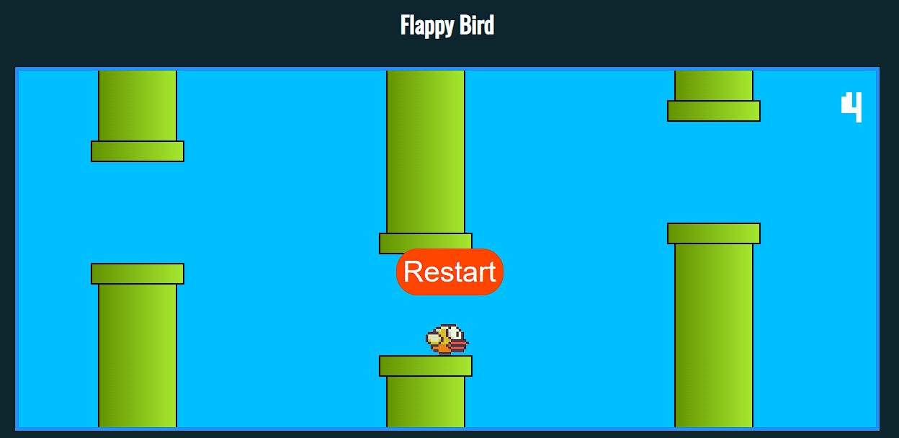

# Flappy Bird

Flappy Bird is an arcade game where you control a little bird that has to fly through various obstacles, all made of tubes.

A simple project to have fun while coding. This was developed using Javascript, HTML and CSS technologies.
The HTML and CSS are used to create the structure and appearance of the game page, while Javascript is used to write game logic and manage game state.

This small project is not focused on the development of a game itself, but on putting into practice the concepts of integration between HTML, CSS and JS.

### Used tools:
- JavaScript
- HTML
- CSS

### Available Scripts

In the project directory, you can run:

- Install the dependencies
    #### `npm i`

- Run the project
    #### Open the `index.html` file in your browser

 

  
  
Figura 1: Captura de tela - Start

  
  
Figura 2: Captura de tela - Play Game

  
  
Figura 3: Captura de tela - Restart (Game Over)

